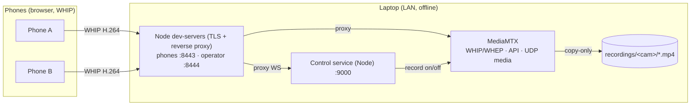

# Wireless Multicam Studio

Turn a handful of phones into a synchronized, multi-angle recording rig — no app
install, no capture hardware, no internet. Phones stream their cameras over your
local WiFi to a laptop that records **every angle losslessly**, while an operator
coordinates the shoot and marks which camera is "on" so the final edit can be cut
in post.

Built for anyone who wants several camera angles without a production budget:
church services, conferences and meetups, school plays and theater, live music,
sports, panel discussions, podcast and interview setups.

## How it works

Phones publish camera + mic over **WebRTC (WHIP)** to **[MediaMTX](https://github.com/bluenviron/mediamtx)**,
which records each stream **copy-only** (no re-encoding — near-zero CPU, original
quality). A small Node control service coordinates everyone (assign cameras,
arm → preview → record, synchronized start). The operator dashboard shows all
feeds live (WHEP) and logs camera switches. Everything runs on the LAN, offline.



Media flows phone↔MediaMTX directly over UDP; only the HTTPS/WebSocket signalling
is proxied, so the laptop does **no video encoding**. The operator's browser
decodes the live grid client-side.

For the full design rationale and the decisions behind it, see **[plan.md](plan.md)**.

## Requirements

- A laptop/desktop (**Windows, macOS, or Linux**) on the same WiFi/LAN as the phones.
- **Node.js 18+** installed. (`tar` is also needed for the tool download — built
  in on macOS, Linux, and Windows 10+.)
- One or more phones with a modern browser (**iOS Safari** or **Android Chrome**).
- A network where the laptop has a stable private IP (a static DHCP lease is ideal).

## Setup (one-time)

```bash
npm install          # install the one runtime dependency (ws)
npm run setup        # download mkcert + MediaMTX + ffmpeg for your OS/arch into tools/
npm run certs        # install a local CA + issue a LAN cert (auto-detects your IP)
```

> On Windows you can alternatively use the PowerShell scripts in `setup\` and
> `scripts\` (`fetch-tools.ps1`, `make-certs.ps1`, `dev-up.ps1`, `dev-down.ps1`);
> they do the same thing.

iOS Safari silently blocks the camera on an untrusted cert, so each phone has to
trust the local CA **once**:

1. On the phone, open `https://<LAN-IP>:8443/rootCA.pem` and install it.
2. **iOS:** install the profile, then Settings ▸ General ▸ About ▸ Certificate
   Trust Settings → enable full trust (both steps required).
   **Android:** Settings ▸ Security ▸ Install a certificate ▸ CA certificate.

## Run

```bash
npm run up           # start MediaMTX + control service + both dev-servers
#   Phones:   https://<LAN-IP>:8443/
#   Operator: https://localhost:8444/   (or https://<LAN-IP>:8444/)
npm run down         # stop everything
```

**Switching networks just works.** `up` re-detects the LAN IP, re-issues the TLS
cert if it changed (the CA is unchanged, so phones stay trusted — no
re-distributing the root cert), and configures MediaMTX accordingly. Move from a
test network to the venue and run `npm run up` there — no hand-editing. To force a
specific address: `npm run up -- --ip 10.0.0.5`.

### Windows installer (optional)

For a no-Node, double-click experience, build a Windows installer that lays down
a ready-to-run folder (launcher + tools + assets + writable dirs), Start Menu /
desktop shortcuts, and a one-time HTTPS-cert setup step:

```bash
npm run setup            # once: make sure tools/ has mkcert + mediamtx + ffmpeg
npm run build:installer  # -> dist/WirelessMulticamStudio-Setup.exe  (Windows, ~300 MB, fully offline)
```

The installer bundles everything (no internet needed on the target), installs to
`Documents\Wireless Multicam Studio`, and adds shortcuts. After installing, run
**"Wireless Multicam Studio (first-time HTTPS setup)"** once (it prompts for
admin to install the local CA), then double-click **Wireless Multicam Studio** to
run. Trust `rootCA.pem` on each phone as above.

### Single binary (optional)

Or just package the launcher into one executable (no installer) so the machine
needs neither Node nor `npm install`:

```bash
npm run build:exe    # -> dist/multicam(.exe)   (uses esbuild + Node SEA; Windows also gets an icon)
```

Drop `multicam(.exe)` into a folder laid out like the repo (with `tools/`,
`phone-pwa/`, `operator-dashboard/`, `mediamtx/`, and writable `certs/ data/
recordings/ exports/ logs/`) — the mkcert/MediaMTX/ffmpeg binaries stay external
in `tools/`. The exe anchors to **its own folder**, so a double-click works
regardless of where Explorer launches it from. Then either:

- **Double-click it** — it starts the whole studio, opens the dashboard, and
  keeps a window open showing the phone/operator URLs. Close the window (or
  press Ctrl+C) to stop everything.
- Or from a terminal: `multicam up` / `multicam down` (background), or
  `multicam start` (same as double-click). No Node required.

First run on a machine still needs `multicam certs` once (installs the local CA).
See [plan.md](plan.md#single-exe-build-no-node-install-to-run) for how the build
works. (Verified on Windows; the macOS/Linux build paths are written but
unverified.)

## Using it

1. **On each phone:** open the phone URL, enter a name, pick front/back, tap
   **Join**. The phone arms and waits. It nudges you to rotate to landscape and
   (where the browser supports it — i.e. Android) reports its battery to the
   dashboard.
2. **On the dashboard:** add/rename cameras as needed, then assign each phone to a
   camera slot (one phone per slot).
3. **Start Preview** — assigned phones begin streaming (not recording yet). Frame
   and check every angle in the live grid.
4. **Pre-flight** (header button, optional) — confirm every camera is live, H.264,
   and has audio, and that the disk is writable, before you commit.
5. **Record** — every live camera starts recording together, copy-only, with a
   synchronized start.
6. **While recording**, click a tile — or press number keys **1–9** — to mark
   which camera is the program feed. Each take is logged with its timestamp.
7. **Stop Recording** — finalizes the switch log for that session.
8. **Recordings** (header button) — browse and download the per-angle files and
   the `switches.json` logs straight from the dashboard, preview a session's
   program edit in-browser, and **Export** any session to a single finished MP4.

## What you get

- **Per-angle recordings:** `recordings/<cam>/<timestamp>.mp4` — lossless
  H.264 + Opus (fMP4), one per camera, quality equal to what the phone streamed.
- **Switch log:** `data/switches.json` — for each recording session: start/stop
  times, each camera's record-start timestamp, and the ordered list of program
  "takes" as offsets from the session start. Use it to cut the multi-angle edit
  in post.

- **Rendered export (optional):** the dashboard can render any session's switch
  log into one finished MP4 (`exports/<session>.mp4`) — the program edit cut from
  the per-angle clips, re-encoded to 1080p30 H.264 + AAC, with black + silence
  filling any missing footage. The lossless per-angle clips remain the masters.

The switch log records the operator's *intent* — it does not produce a live
switched output. (Live switched streaming is intentionally out of scope; see
[plan.md](plan.md#future-live-streaming-not-v1).)

## Ports & firewall

| Port | Proto | Purpose | Exposure |
|---|---|---|---|
| 8443 | tcp | Phone server (HTTPS) | LAN |
| 8444 | tcp | Operator dashboard (HTTPS) | LAN / localhost |
| 8189 | udp | WebRTC media (ICE) | LAN |
| 9000 / 9997 / 8889 | tcp | control / MediaMTX API / WHIP-WHEP | localhost only |

Open **8443/tcp**, **8444/tcp** (if the operator is on another machine), and
**8189/udp** on the laptop's firewall.

## Limitations

- **No authentication.** Anyone on the LAN can open the dashboard, control a
  session, and download recordings. Run it on a trusted network.
- The cross-platform Node launcher is exercised on Windows; the macOS/Linux code
  paths (tool download/extract, `lsof`-based stop) are written but not yet
  verified on those OSes.

## Project layout

```
phone-pwa/            Phone capture client (WHIP + control WS)
operator-dashboard/   Operator UI (control WS + WHEP grid + switch log)
control/              Node control service (cameras, slots, record, switch log) + tests
mediamtx/             MediaMTX config template (dev-up renders the per-network copy)
dev-server.mjs        TLS static server + WHIP/WHEP/WS reverse proxy
cli/                  Cross-platform launcher (npm run setup|certs|up|down)
build/                esbuild bundle + Node SEA single-exe build (npm run build:exe)
setup/, scripts/      Windows PowerShell equivalents of the CLI commands
milestone0/, milestone1/   Standalone diagnostics (camera-over-HTTPS, single publisher)
plan.md               Full design doc
```

## Built on

[MediaMTX](https://github.com/bluenviron/mediamtx) ·
[mkcert](https://github.com/FiloSottile/mkcert) ·
[FFmpeg](https://ffmpeg.org/) ·
[ws](https://github.com/websockets/ws)

## License

MIT — see [LICENSE](LICENSE).
