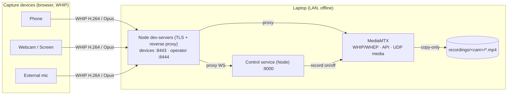

# Wireless Multicam Studio

> `idle-stream` is the repo; **Wireless Multicam Studio** is the product.

Turn a handful of phones (and any webcams, screen shares, or external mics you
have around) into a synchronized, multi-angle recording rig — no app install,
no capture hardware, no internet. Devices stream over your local WiFi to a
laptop that records **every angle losslessly**, while an operator coordinates
the shoot and marks which camera is "on" so the final edit can be cut in post.

Built for anyone who wants several camera angles without a production budget:
church services, conferences and meetups, school plays and theater, live music,
sports, panel discussions, podcast and interview setups.

## How it works

Devices publish camera + mic (or a screen share, or an audio-only mic feed) over
**WebRTC (WHIP)** to **[MediaMTX](https://github.com/bluenviron/mediamtx)**,
which records each stream **copy-only** (no re-encoding — near-zero CPU,
original quality). A small Node control service coordinates everyone (assign
sources, arm → preview → record, synchronized start). The operator dashboard
shows all feeds live (WHEP) and logs camera switches. Everything runs on the
LAN, offline.



Media flows device↔MediaMTX directly over UDP; only the HTTPS/WebSocket
signalling is proxied, so the laptop does **no video encoding** during
recording. The operator's browser decodes the live grid client-side.

For the full design rationale and the decisions behind it, see **[plan.md](plan.md)**.

## Requirements

- A laptop/desktop on the same WiFi/LAN as the devices.
- **Node.js 18+** installed. (`tar` is also used for the tool download — built
  in on macOS, Linux, and Windows 10+.)
- One or more phones with a modern browser (**iOS Safari** or **Android Chrome**),
  and/or any laptop running a modern browser for webcam, screen share, or
  external-mic capture.
- A network where the laptop has a stable private IP (a static DHCP lease is ideal).

## Setup (one-time)

```bash
npm install          # install the one runtime dependency (ws); the rest are build-time only
npm run setup        # download mkcert + MediaMTX + ffmpeg for your OS/arch into tools/
npm run certs        # install a local CA + issue a LAN cert (auto-detects your IP)
```

> On Windows you can alternatively use the PowerShell scripts in `setup\` and
> `scripts\` (`fetch-tools.ps1`, `make-certs.ps1`, `dev-up.ps1`, `dev-down.ps1`);
> they do the same thing.

iOS Safari silently blocks the camera on an untrusted cert, so each phone has to
trust the local CA **once**. Easiest: open **`https://<LAN-IP>:8443/setup.html`**
on the phone — a guided page with a "Download certificate" button, the exact
per-platform trust steps, and a QR code (display it on the laptop for other
phones to scan). Or do it manually:

1. On the phone, open `https://<LAN-IP>:8443/rootCA.pem` and install it.
2. **iOS:** install the profile, then Settings ▸ General ▸ About ▸ Certificate
   Trust Settings → enable full trust (both steps required).
   **Android:** Settings ▸ Security ▸ Install a certificate ▸ CA certificate.

(It's once per phone and survives WiFi changes — the CA stays the same.
Webcams and screen-share desktops run in the browser of a machine that already
trusts the cert, so they don't need this step.)

## Run

```bash
npm run up           # start MediaMTX + control service + both dev-servers
#   Devices:  https://<LAN-IP>:8443/
#   Operator: https://localhost:8444/   (or https://<LAN-IP>:8444/)
npm run down         # stop everything
```

**Switching networks just works.** `up` re-detects the LAN IP, re-issues the
TLS cert if it changed (the CA is unchanged, so phones stay trusted — no
re-distributing the root cert), and configures MediaMTX accordingly. To force
a specific address: `npm run up -- --ip 10.0.0.5`.

### Windows installer (optional)

For a no-Node, double-click experience, grab **`WirelessMulticamStudio-Setup.exe`**
from the latest [GitHub Release](https://github.com/openidle-dev/idle-stream/releases/latest).
It's built in CI on every `v*` tag and ships everything offline (launcher +
tools + assets + writable dirs), with Start Menu / desktop shortcuts and a
one-time HTTPS-cert setup step.

> The installer is currently **unsigned**, so Windows SmartScreen will warn
> on first run — click *More info* → *Run anyway*.

Prefer to build it yourself? You'll need the native tools first:

```bash
npm run setup            # once: make sure tools/ has mkcert + mediamtx + ffmpeg
npm run build:installer  # -> dist/WirelessMulticamStudio-Setup.exe  (Windows, ~300 MB, fully offline)
```

The installer installs to `Documents\Wireless Multicam Studio` and adds
shortcuts. After installing, run **"Wireless Multicam Studio (first-time HTTPS
setup)"** once (it prompts for admin to install the local CA), then launch
**Wireless Multicam Studio**.

The launcher runs as a **system-tray icon** (no console window):

- Right-click for *Open Operator Dashboard*, *Open Device Page*, *Show URLs*,
  and *Stop & Quit*.
- The operator dashboard opens at **`https://studio.localhost:8444/`** — a
  trusted, friendly URL (`*.localhost` resolves to this machine automatically;
  the cert covers it).
- Trust `rootCA.pem` on each phone as above; phones use the LAN-IP URL from
  *Show URLs*.

### Single binary (optional)

Or just package the launcher into one executable (no installer) so the machine
needs neither Node nor `npm install`:

```bash
npm run build:exe    # -> dist/multicam(.exe)   (uses esbuild + Node SEA; Windows also gets an icon)
```

Drop `multicam(.exe)` into a folder laid out like the repo (with `tools/`,
`phone-pwa/`, `operator-dashboard/`, `mediamtx/`, and writable
`certs/ data/ recordings/ exports/ logs/`) — the mkcert/MediaMTX/ffmpeg
binaries stay external in `tools/`. The exe anchors to **its own folder**, so
a double-click works regardless of where Explorer launches it from. Then either:

- **Double-click it** — it starts the whole studio, opens the dashboard, and
  keeps a window open showing the device/operator URLs. Close the window (or
  press Ctrl+C) to stop everything.
- Or from a terminal: `multicam up` / `multicam down` (background), or
  `multicam start` (same as double-click). No Node required.

First run on a machine still needs `multicam certs` once (installs the local CA).
See [plan.md](plan.md#single-exe-build-no-node-install-to-run) for how the
build works.

## Using it

1. **On each device:** open the device URL, enter a name, pick a **source**,
   tap **Join**. Sources:
   - **Camera** — a phone's front/back camera or a laptop webcam.
   - **Screen share** — desktop browsers + Android Chrome, via the browser's
     screen-picker (not available on iOS).
   - **Audio only (mic)** — any audio input on the device (e.g. a USB or
     wireless lavalier mic plugged into a phone or laptop), no video.

   The device arms and waits; phone cameras nudge you to rotate to landscape
   and (on Android) report battery.

2. **On the dashboard:** add cameras under **Cameras** and external mics under
   **Audio sources**, rename as needed, then assign each device to a slot
   (one device per slot). For external mics you can also **link** the mic to
   a camera (so the export defaults that camera's audio to the mic) and tap
   **Listen** to monitor the mic in your browser before recording.

3. **Start Preview** — assigned cameras begin streaming (not recording yet).
   Frame and check every angle in the live grid. The header **Bitrate**
   selector sets the global publish quality (4–12 Mbps); each camera can
   override it in the Cameras panel. Changes apply live — devices adjust
   mid-session with no reconnect.

4. **Pre-flight** (header button, optional) — confirm every camera is live,
   H.264, and has audio, and that the disk is writable, before you commit.

5. **Record** — every live source starts recording together, copy-only, with a
   synchronized start.

6. **While recording**, click a tile — or press number keys **1–9** — to mark
   which camera is the program feed. Each take is logged with its timestamp.

7. **Stop Recording** — finalizes the switch log for that session.

8. **Recordings** (header button) — browse and download the per-source files
   and the `switches.json` logs straight from the dashboard, preview a
   session's program edit in-browser (with click-to-route mic mixing per
   section), and **Export** any session to a single finished MP4.

## What you get

- **Per-source recordings:** `recordings/<cam>/<timestamp>.mp4` — lossless
  H.264 + Opus (fMP4), one per camera, quality equal to what the device
  streamed. External mics record to their own `mic*` directories.
- **Switch log:** `data/switches.json` — for each recording session: start/stop
  times, each source's record-start timestamp, and the ordered list of program
  "takes" as offsets from the session start. Use it to cut the multi-angle
  edit in post.
- **Rendered export (optional):** the dashboard can render any session's
  switch log into one finished MP4 (`exports/<session>.mp4`) — the program
  edit cut from the per-angle clips, re-encoded to 1080p30 H.264 + AAC, with
  black + silence filling any missing footage, hardware-accelerated H.264
  where available (NVENC/QuickSync/AMF/VideoToolbox). Optional **crossfade
  transitions** (0.3/0.5/1.0s dissolves between angles); default is clean
  hard cuts. Per-section audio routing (mix or replace the camera's audio
  with an external mic, with volume sliders) carries through to the rendered
  output. The lossless per-angle clips remain the masters.

The switch log records the operator's *intent* — it does not produce a live
switched output. (Live switched streaming is intentionally out of scope; see
[plan.md](plan.md#future-live-streaming-not-v1).)

## Ports & firewall

| Port | Proto | Purpose | Exposure |
|---|---|---|---|
| 8443 | tcp | Device server (HTTPS) | LAN |
| 8444 | tcp | Operator dashboard (HTTPS) | LAN / localhost |
| 8189 | udp | WebRTC media (ICE) | LAN |
| 9000 | tcp | Control service | localhost only |
| 9997 | tcp | MediaMTX API | localhost only |
| 8889 | tcp | WHIP / WHEP signalling | localhost only |

Open **8443/tcp**, **8444/tcp** (if the operator is on another machine), and
**8189/udp** on the laptop's firewall.

## Security & trust model

This is a **LAN-trusted** app. There is no user authentication: anyone on the
same network who reaches the operator URL can drive the studio. Run it on a
network you control. The control service and MediaMTX API are bound to
`127.0.0.1`, so only the device page (`:8443`) and operator dashboard (`:8444`)
are LAN-reachable. WebSocket upgrades enforce same-origin to block cross-tab
CSRF from a victim's browser. See [SECURITY.md](SECURITY.md) for the full
model and how to report issues.

## Limitations

- **No authentication.** Anyone on the LAN can open the dashboard, control a
  session, and download recordings. Run it on a trusted network.
- **Cross-platform support is staged.** Windows is fully verified end-to-end
  (CLI, installer, tray launcher, single-exe build). The macOS and Linux code
  paths are audited (tool-download URLs HEAD-checked, `down()` falls back from
  `lsof` to `ss -ltnp` on minimal Linux, libvirt's `virbr` is skipped in
  LAN-IP detection, SEA build skips the Windows-only PE icon step) but not
  yet exercised on real hardware — see the Roadmap below.
- The one-click installer and the tray launcher are **Windows-only** today.

## Roadmap

The four GitHub issues that scoped the v1 build are mostly **closed**:
[#2 crossfade transitions](https://github.com/openidle-dev/idle-stream/issues/2),
[#3 screen capture](https://github.com/openidle-dev/idle-stream/issues/3),
and [#4 external mic audio](https://github.com/openidle-dev/idle-stream/issues/4)
all shipped and are documented above. The remaining roadmap item is the
big one:

- **[macOS & Linux support](https://github.com/openidle-dev/idle-stream/issues/1)**
  — verify the CLI/`multicam` binary on those OSes end-to-end, then per-OS
  packaging (`.dmg`/`.app`, AppImage/`.deb`) and a window-free tray (macOS
  menubar, Linux libappindicator). Help wanted.

Beyond that, things that would be useful but aren't blocking anything:
multi-mic mixing per camera, low-battery warnings on the operator dashboard,
a configurable export resolution/bitrate, and frame-accurate clip alignment.

## Project layout

```
phone-pwa/            Device capture client (WHIP + control WS) — phones, webcams, screen share, audio-only
operator-dashboard/   Operator UI (control WS + WHEP grid + switch log + export)
control/              Node control service (cameras, slots, record, switch log, export) + tests
mediamtx/             MediaMTX config template (dev-up renders the per-network copy)
dev-server.mjs        TLS static server + WHIP/WHEP/WS reverse proxy
cli/                  Cross-platform launcher (npm run setup|certs|up|down)
build/                esbuild bundle + Node SEA single-exe build (npm run build:exe)
setup/, scripts/      Windows PowerShell equivalents of the CLI commands
tray.ps1              Windows hidden-PowerShell system-tray launcher
docs/diagnostics/     Standalone bring-up artifacts (M0 getUserMedia, M1 single-WHIP publisher)
icon.png              Windows installer + single-exe icon (raster source)
plan.md               Full design doc
LICENSE               MIT
SECURITY.md           Reporting + the LAN trust model
```

## Built on

[MediaMTX](https://github.com/bluenviron/mediamtx) ·
[mkcert](https://github.com/FiloSottile/mkcert) ·
[FFmpeg](https://ffmpeg.org/) ·
[ws](https://github.com/websockets/ws)

## License

MIT — see [LICENSE](LICENSE).
