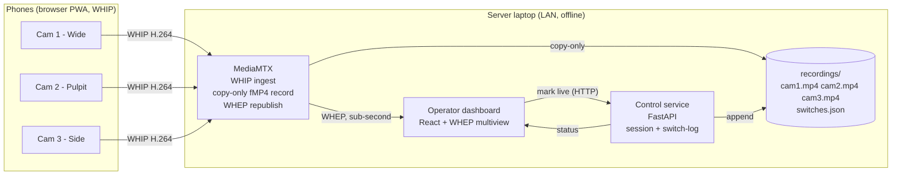

# Church Sermon Multi-Cam Recording System

A local-network recording studio. Phones act as wireless cameras streaming over WebRTC (WHIP) to a server that records each angle losslessly and drives a live operator view for marking which angle is "live". The final edit is cut in post from the clean per-angle files using the operator's switch-log as a guide.

> **Architecture note (post-research rewrite).** An earlier draft built the media plane in Python with `aiortc` (custom SFU + `MediaRecorder`). Research killed that: aiortc decodes **and re-encodes** every stream with no passthrough, runs on a single asyncio loop, and realistically handles only ~2 simultaneous 1080p streams on a laptop before frame drops and A/V drift. This rewrite delegates the media plane to **MediaMTX** (WHIP ingest + lossless per-camera recording + WHEP republish) and keeps only thin, high-value custom code: the phone capture PWA, the operator dashboard, and setup/cert tooling. **No live-switched output in v1**, so there is no program encoder and no OBS in the core stack — switching is a logged decision used in post-production. See [Key Architecture Decisions](#key-architecture-decisions).

## Goals

1. **Wireless cameras**: Phones run a browser PWA — no app install. Each phone streams camera + mic over local WiFi.
2. **Multi-angle live preview**: Operator sees all camera feeds simultaneously in a low-latency grid on a laptop.
3. **Switch marking**: Operator clicks (or hits 1/2/3) to mark which angle is "live". This is recorded to a switch-log, not rendered into a video feed — there is no live program encode in v1.
4. **Recording**: Every camera is recorded individually to its own file **without re-encoding** (archival fidelity, near-zero CPU). The edit is reconstructed in post (DaVinci/Premiere) from these files + the switch-log.
5. **Self-contained**: Runs entirely on a local network. No internet required at service time. (Internet may be needed once, at setup, only if you pick the public-cert option — the recommended cert path is fully offline.)
6. **Future (not v1): optional live streaming.** Pushing a switched feed to RTMP is deliberately deferred; see [Future: Live Streaming](#future-live-streaming-not-v1).

## Key Architecture Decisions

Each decision is grounded in the research behind this rewrite. The killer constraints: **avoid re-encoding 4 streams on a laptop**, **run offline on a LAN**, and **work on iOS Safari**.

### Don't build the media plane — `aiortc` re-encodes everything

aiortc's receive path depacketizes RTP and decodes it to raw `av.Frame` objects before your code sees it; `MediaRecorder` then re-encodes with software libx264. There is **no remux/copy path to MP4**, and the maintainer rejected a passthrough PR as incompatible with the WebRTC stack's needs. All encode/decode is funneled through one asyncio event loop, so users report frame-rate drops with multiple clients even when CPU/bandwidth aren't saturated. Net: an i5/Ryzen-5 mobile laptop saturates at roughly **2 streams** before drops/drift, and multi-track handling has historically been buggy.

### MediaMTX for ingest + lossless per-camera recording

[MediaMTX](https://github.com/bluenviron/mediamtx) is a single Go binary that accepts **WHIP** (WebRTC-HTTP Ingest) directly from browsers, **records each stream to fMP4 without re-encoding**, republishes as WHEP/RTSP, and runs fully offline. This nails the CPU-sensitive part: 3–4 archival angles cost ~zero CPU because they're written copy-only. In v1 this is essentially the *entire* media plane.

### Switching is a logged decision, not a live encode

Because there's no live-switched output in v1, the operator's "take cam 2" never touches a video encoder — it appends `{ts, camera}` to `switches.json`. This eliminates the hardest part of the original design (a persistent-encoder compositor) and removes OBS from the stack. The per-angle files + switch-log let an editor recreate (or improve on) the live edit in post — a frame-accurate master that survives a bad live cut. If live output is ever needed, see [Future](#future-live-streaming-not-v1); the research-backed answer there is OBS, never a hand-rolled FFmpeg/GStreamer switcher.

### Operator sees a browser WHEP grid

The operator dashboard subscribes to each camera over **WHEP** (WebRTC playback from MediaMTX) directly in the browser — sub-second latency, decoding happens client-side, zero server cost. Clicking a tile (or pressing 1/2/3) calls the control API, which logs the switch.

### Force H.264 end-to-end so recording stays copy-only

MediaMTX records copy-only only if the ingested codec matches the container. iOS Safari already prefers/sends **H.264**; Android Chrome can be constrained to H.264. We force H.264 in the WHIP offer so every archival recording is a clean remux. (VP8 fallback still records fine, just not copy-only.)

### TLS that iOS Safari actually trusts (make-or-break)

`getUserMedia` requires a secure context. On a LAN IP over `http://`, `navigator.mediaDevices` is simply `undefined`. **iOS Safari does *not* honor "accept the risk" on a self-signed cert** — it silently blocks camera access even after you tap through the warning. The robust, fully-offline fix is a **local CA via `mkcert`**: install the CA root on each phone once, issue a leaf cert bound to the laptop's **static LAN IP** (IP SAN, not `.local` — iOS `.local` resolution is unreliable and often blocked by AP client-isolation). On iOS this is two steps people miss: install the profile **and** flip *Settings ▸ General ▸ About ▸ Certificate Trust Settings* to full trust. See [Secure Context & TLS](#secure-context--tls-setup).

## Architecture Overview



The server does almost no media work: MediaMTX writes copy-only files; the operator's browser decodes the WHEP grid client-side. There is no server-side encode in v1.

## Tech Stack

### Media plane (config, not code)
- **MediaMTX** (single Go binary) — WHIP ingest, copy-only recording, WHEP/RTSP republish.

### Control service (thin custom backend)
- **Python 3.11+ / FastAPI / uvicorn / pydantic**
- Talks to MediaMTX's HTTP API for camera/recording status.
- Owns session lifecycle, the switch-log, and serving config/status to the dashboard.

### Phone PWA (thin custom frontend)
- **React 18 + Vite + TypeScript**, built as a PWA (`vite-plugin-pwa`).
- A small **WHIP client** (HTTP POST of the SDP offer to MediaMTX's `/{cam}/whip` endpoint) — far simpler than custom WebSocket signalling.
- `getUserMedia` with H.264 preference; locked landscape; `navigator.wakeLock`; battery + connection-quality indicators; reconnect with backoff.

### Operator dashboard (thin custom frontend)
- **React 18 + Vite + TS + Tailwind**.
- **WHEP playback client** per camera (low-latency multiview grid).
- Calls the control service to mark the live angle; renders recording/connection status and audio meters.

### Infra
- **Docker Compose** for MediaMTX + control service + static hosts for the two frontends. No GUI apps; the whole stack is `docker-compose up`.

## Repository Layout

```
sermon-studio/
├── mediamtx/
│   └── mediamtx.yml             # WHIP ingest paths, copy-only recording, WHEP republish
├── control/                     # FastAPI control service
│   ├── app/
│   │   ├── main.py              # endpoints + session lifecycle
│   │   ├── mediamtx.py          # MediaMTX HTTP API client (streams, recording)
│   │   ├── state.py             # in-memory session/camera/switch-log
│   │   ├── models.py            # pydantic models
│   │   └── config.py
│   ├── tests/
│   ├── pyproject.toml
│   └── Dockerfile
├── phone-pwa/
│   ├── src/
│   │   ├── App.tsx              # label, camera select, start/stop, status
│   │   ├── lib/whip.ts          # WHIP client (getUserMedia → SDP POST)
│   │   └── lib/quality.ts       # getStats bitrate/connection display
│   ├── vite.config.ts           # PWA plugin
│   └── package.json
├── operator-dashboard/
│   ├── src/
│   │   ├── App.tsx              # grid + live marker + controls
│   │   ├── components/{CameraTile,Controls,AudioMeter}.tsx
│   │   └── lib/whep.ts          # WHEP playback client
│   └── package.json
├── setup/
│   ├── make-certs.sh / .ps1     # mkcert: CA + leaf for static LAN IP
│   └── cert-distribution/       # one-time page to download rootCA.pem to phones
├── docker-compose.yml
├── recordings/                  # mounted volume: cam*.mp4, switches.json
└── README.md
```

## Secure Context & TLS Setup

The highest-risk, make-or-break item. Get it working on a real iPhone **before** building anything else (Milestone 0).

**Why self-signed fails on iOS:** `getUserMedia` only exists in a secure context. On `http://<LAN-IP>` it's unavailable outright. With a self-signed cert, desktop browsers let you proceed after accepting the warning — **iOS Safari does not**; it treats the context as insecure and blocks `mediaDevices` even after you accept. So the cert must be genuinely *trusted* on each phone.

**Recommended: `mkcert` local CA + static LAN IP (fully offline).**

1. Give the laptop a **static LAN IP** on the router (e.g. `192.168.8.10`).
2. On the laptop: `mkcert -install` then `mkcert 192.168.8.10` → leaf cert + key (IP SAN). Serve MediaMTX/control/frontends on `:8443` with this cert; all signalling and WHIP/WHEP over `https`/`wss`.
3. `mkcert -CAROOT` → copy `rootCA.pem` to each phone (AirDrop / USB / the one-time `setup/cert-distribution` http page).
4. **iOS:** install the profile (*Settings ▸ General ▸ VPN & Device Management*), **then** *Settings ▸ General ▸ About ▸ Certificate Trust Settings* → enable full trust. Both steps are mandatory.
5. **Android:** *Settings ▸ Security ▸ Encryption & credentials ▸ Install a certificate ▸ CA certificate* (a "network may be monitored" banner is expected).
6. Open `https://192.168.8.10:8443/phone` → camera prompt appears normally; PWA install and service worker also work (they require a secure context too).

**Cert constraints (iOS 13+):** hostname/IP must be in a **SAN** (CommonName ignored), SHA-2 + RSA ≥ 2048, leaf validity ≤ 825 days. `mkcert` satisfies these. Regenerate leaves from the same long-lived root without re-installing on phones.

**Avoid `.local`:** iOS mDNS resolution is unreliable and APs often block it via client-isolation. Use the IP.

**Public-cert alternative (only if periodic internet is acceptable):** `sslip.io` + Let's Encrypt gives a genuinely-trusted cert with no per-phone install — but needs internet at issuance, renews ≤90 days, and **breaks if the router has DNS-rebinding protection**. For a permanently-offline church router, the `mkcert` local CA is more robust. Self-signed "accept anyway" is **not** an option (fails on iOS).

**WebRTC mDNS ICE obfuscation is a non-issue here:** browsers only obfuscate host candidates to `*.local` when gathered *without* camera permission; once the phone has `getUserMedia` permission, real LAN host candidates are exposed and phone↔server media flows on the same network.

## Component Details

### Phone PWA (capture + WHIP)

UX:
- **Landing**: label input ("Wide" / "Pulpit" / "Side"), front/back camera selector, big green **Start**.
- **Live**: local camera preview, connection indicator (green/red), prominent label, **Stop**.
- Lock landscape; `navigator.wakeLock.request("screen")`; warn under 20% battery; show rough bitrate from `RTCPeerConnection.getStats()`.

Capture constraints (force H.264 so recording stays copy-only):
```typescript
const constraints = {
  video: { facingMode: "environment", width: { ideal: 1920 }, height: { ideal: 1080 }, frameRate: { ideal: 30 } },
  audio: { echoCancellation: false, noiseSuppression: false, autoGainControl: false, sampleRate: 48000 },
};
// In the WHIP offer, prefer/force H.264 via
// RTCRtpTransceiver.setCodecPreferences() (put video/H264 first).
```

WHIP connection logic:
- On Start: `getUserMedia`, create `RTCPeerConnection`, `addTrack` for video+audio, set H.264 codec preference, create offer, `setLocalDescription`, **HTTP POST the SDP** to MediaMTX `https://<ip>:8443/<cam>/whip`, apply the SDP answer. (WHIP replaces the bespoke WebSocket offer/answer/ICE dance.)
- On disconnect: reconnect with exponential backoff (1→2→4→8s, cap 30s).

Audio note: phone audio is mediocre and ambient. Architect so a dedicated source (lavalier into the wide phone) can replace it later. Other phones keep recording audio as backup.

### MediaMTX (ingest + recording + republish)

`mediamtx.yml` defines a path per camera with:
- WHIP ingest enabled, recording on (`record: yes`, fMP4, copy-only), output to `recordings/<session>/<cam>.mp4` (segment/rotate as desired).
- WHEP read enabled (for the dashboard).

The control service queries MediaMTX's HTTP API for which cameras are publishing, byte counts / file growth, and to start/stop recording at session boundaries.

### Operator Dashboard (WHEP multiview + switch marking)

Layout:
- Top bar: session name, recording dot, elapsed time, **Stop Session**.
- 2×2 (or 1×3) grid of cameras; the currently-marked-live tile gets a red "LIVE" border.
- Sidebar: per-camera Take buttons, keyboard-shortcut legend, audio meters.
- Bottom bar: recording file list with live-updating sizes (from MediaMTX API).

Switch marking: clicking a tile / pressing 1·2·3 → optimistic local highlight → `POST /api/sessions/{id}/live` → control service appends `{ts, camera}` to `switches.json`. No video is rendered; this is purely an editorial marker for post.

Keyboard: `1/2/3` mark live, `R` toggle recording, `Space` mark wide (cam1).

Audio meters: `AudioContext.createAnalyser()` per WHEP stream, VU bar via `requestAnimationFrame`; green < −18 dBFS, yellow −18..−6, red > −6.

### Control Service Endpoints

```
GET    /api/health                       # liveness
POST   /api/sessions                     # start session: tell MediaMTX to begin recording all cams
POST   /api/sessions/{id}/stop           # stop: finalize recordings, close switch-log
GET    /api/sessions/{id}                # session + camera status (proxied from MediaMTX)
POST   /api/sessions/{id}/live           # body {cameraId}: append to switches.json
GET    /api/recordings/{session_id}      # list files + sizes
GET    /api/recordings/{session_id}/{f}  # download a recording
WS     /api/events                       # push camera/recording/live-marker state to dashboard
```

## Network Setup

- **Dedicated portable router** (e.g. GL.iNet Flint, ~$80) brought each Sunday. Avoids church-WiFi congestion and client-isolation (which blocks phone↔laptop). Laptop on Ethernet; phones on 5 GHz.
- Laptop static IP; bind MediaMTX/control/frontends to `0.0.0.0`.
- **Bandwidth**: ~3 Mbps/cam at 1080p30 → ~10 Mbps ingest. WHEP to the dashboard re-sends each (~10 Mbps out). Easy on 5 GHz.
- **CPU**: minimal. Copy-only recording is ~free; the only decode is in the operator's browser (client-side). No server-side encode in v1 — far lighter than the rejected aiortc decode+re-encode design.

## Build Order

Each milestone is a working, demoable system. **Milestone 0 is a hard gate** — if camera access on a real iPhone doesn't work, nothing else matters.

### Milestone 0: iPhone camera access over LAN HTTPS
- `mkcert` CA + IP-SAN leaf; install root on a real iPhone (both iOS steps) and an Android phone.
- A trivial page on `https://<ip>:8443` that calls `getUserMedia` and shows the preview.
- **Success**: both phones show live self-preview with no cert warning.

### Milestone 1: Single phone → MediaMTX → disk (lossless)
- MediaMTX configured for one WHIP path with copy-only recording.
- Phone PWA: Start button, `getUserMedia` with H.264 preference, WHIP POST.
- **Success**: record 1 minute, play the MP4 in VLC; confirm it's a remux (no quality loss, low CPU).

### Milestone 2: Operator preview (1 camera, WHEP)
- Dashboard subscribes to the camera via WHEP and renders one tile.
- **Success**: live preview < 500 ms latency in the browser.

### Milestone 3: Three cameras
- Three WHIP paths; three phones publish simultaneously; three copy-only recordings.
- Dashboard shows the multiview grid.
- **Success**: 3 phones streaming, 3 files growing, operator sees all 3; verify laptop CPU headroom.

### Milestone 4: Switch marking + switch-log
- Control service writes `switches.json`; dashboard click + 1/2/3 keys highlight the live tile and log the timestamp.
- **Success**: switch-log accurately reflects the operator's takes; a test edit in DaVinci using the log + per-angle files reconstructs the intended cut.

### Milestone 5: Audio meters & resilience
- WHEP VU meters; connection indicators (red on phone drop); recording start/stop + elapsed + file sizes; phone reconnect with backoff.
- **Success**: a phone losing WiFi for 10 s reconnects and resumes recording automatically.

### Milestone 6: Pre-flight check & polish
- Dashboard "Test" mode: all cameras publishing, codec is H.264, recording writing (files growing), audio present.
- **Success**: one screen confirms the rig is service-ready.

### Milestone 7: Stretch
- Lower-thirds metadata in the switch-log, dedicated audio interface, multi-operator (others spectate WHEP), cloud upload of finished files, web playback, auth (password or IP allowlist), and the **live-streaming** option below.

## Future: Live Streaming (not v1)

If the church later wants to push a switched feed to RTMP (YouTube/Facebook), this is the part that requires real care and is intentionally out of v1.

- The hard problem: restarting/swapping an encoder mid-stream changes the H.264 SPS/PPS, forces an IDR, and resets PTS, which makes YouTube/Facebook treat the stream as corrupt and drop it. You need **one persistent encoder fed by a switchable compositor**.
- The research-backed answer is **OBS** driven over **obs-websocket** (`SetCurrentProgramScene`): switching scenes never restarts the encoder or the RTMP socket. Cameras feed OBS as RTSP/WHEP sources from MediaMTX (one scene each); the control service issues scene cuts on the same switch action that today only logs.
- Do **not** hand-roll an FFmpeg `streamselect` / GStreamer `input-selector` compositor — that reimplements decode-sync-scale-encode plumbing OBS gives for free and is where stream-dropping bugs hide.
- This adds a GUI app (OBS, native/minimized on the host — awkward to containerize) and a single hardware encode (NVENC/QSV/VAAPI strongly preferred) to the otherwise encode-free v1 stack. That cost is exactly why it's deferred until the requirement is real.
- A lighter middle ground if "live" is needed but switching isn't: MediaMTX can restream a **single fixed camera** to RTMP directly, with no OBS and no switching of the live feed.

## Things to Get Right

- **Time sync**: Per-camera recordings start at slightly different moments. The control service records each file's wall-clock start time at session start (alongside `switches.json`). Audio-waveform sync in post is the source of truth for fine alignment.
- **Clock drift**: Independent phone clocks drift a fraction of a second over 45 min — expected; resolve in post via waveform.
- **Codec lock**: Verify the WHIP negotiation settled on H.264 (MediaMTX logs / inspect the file). VP8 fallback still records but won't be copy-only into MP4 — catch this in the pre-flight check.
- **Audio routing**: Default phone audio is ambient/mediocre. Plan for a dedicated source feeding the wide phone (or, once streaming exists, a USB interface into OBS).
- **Storage**: 1080p30 H.264 ≈ 130 MB/min. 3 cams × 45 min ≈ 17.5 GB/service. Budget ~900 GB/year or auto-upload+delete.
- **Power**: Phones drain fast streaming — each on a charger, cables ready before the service.
- **Pre-flight check**: Run Milestone-6 "Test" mode before every sermon.

## Out of Scope (for now)

- iOS native app (PWA is sufficient).
- Cloud-based recording (local-only by design).
- Multi-site federation.
- Slow-motion / high frame rate.
- Any rendered program output (PiP, split-screen, or even a single switched program file) — v1 records angles + a switch-log only.
- Live RTMP streaming — deferred to [Future](#future-live-streaming-not-v1).
- A custom FFmpeg/GStreamer compositor — explicitly rejected.

## Testing Strategy

- **Unit (control service)**: session lifecycle, switch-log writing, MediaMTX API client (mock HTTP).
- **Integration**: spin up MediaMTX + control service; Playwright drives the phone PWA with Chrome's `--use-fake-device-for-media-stream` (fake camera) and the operator dashboard; assert end-to-end: phone WHIP-publishes → dashboard WHEP-previews → file is recorded → switch marking appends to the log.
- **Manual smoke test**: weekly pre-service checklist (Milestone-6 "Test" mode): phones connect, codec H.264, recording writes, switch marking logs, stop session, verify files.

## Deployment

- `docker-compose up` brings up MediaMTX + control service + the two static frontends. No GUI apps in v1.
- Phone PWA: `https://<laptop-ip>:8443/phone`. Operator dashboard: `https://<laptop-ip>:8443/operator`.
- `recordings/` mounted on the host for easy retrieval.

## Quickstart

```bash
git clone <repo> && cd sermon-studio

# One-time, on the laptop:
./setup/make-certs.sh            # mkcert CA + leaf for the static LAN IP
# Install rootCA.pem on each phone (iOS: profile + Certificate Trust Settings; Android: CA cert)

docker-compose up --build        # MediaMTX + control service + frontends

# Operator dashboard: https://<laptop-ip>:8443/operator
# Each phone:          https://<laptop-ip>:8443/phone  → set label → Start
```

## Open Questions / Risks

- **WHIP browser support / codec negotiation**: Confirm both target phones reliably negotiate H.264 over WHIP into MediaMTX; have a VP8 fallback plan (recording still works, just not copy-only).
- **WHEP multiview load on the operator laptop**: Decoding 3–4 simultaneous 1080p WHEP streams is client-side; confirm the operator's browser/machine handles it smoothly, and consider requesting a lower-resolution WHEP layer for the grid if needed.
- **MediaMTX recording segmentation**: Decide segment/rotation policy and confirm clean playback of long (45-min) files.

## Reference Reading

- MediaMTX (WHIP ingest, recording, republish): https://github.com/bluenviron/mediamtx
- WHIP spec (RFC 9725): https://datatracker.ietf.org/doc/rfc9725/
- mkcert (local CA): https://github.com/FiloSottile/mkcert
- iOS trusting manually installed roots: https://support.apple.com/en-us/102390 and https://support.apple.com/en-us/103769
- MDN getUserMedia (secure context): https://developer.mozilla.org/en-US/docs/Web/API/MediaDevices/getUserMedia
- (Future/live) obs-websocket protocol: https://github.com/obsproject/obs-websocket/blob/master/docs/generated/protocol.md
- (Future/live) RTMP input requirements (why cuts drop streams): https://developer.bitmovin.com/encoding/docs/rtmp-live-stream-input-requirements
```