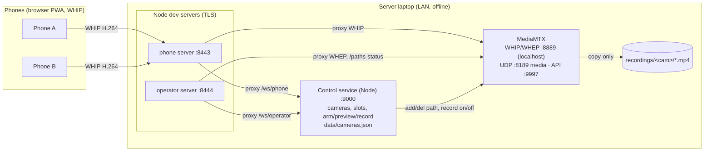

# Wireless Multicam Studio

A local-network recording studio. Phones act as wireless cameras streaming over WebRTC (WHIP) to a server that records each angle losslessly. An operator dashboard coordinates the phones (assign cameras, arm → preview → record) and shows all feeds live. The final edit is cut in post from the clean per-angle files.

> **Status (living doc).** This spec now reflects what is actually built. Milestones 0–3 plus the operator control service, dynamic cameras, and the editorial switch log are implemented and validated on real iOS + Android phones. Live-switched RTMP remains deliberately out of scope (see [Future](#future-live-streaming-not-v1)). Implementation status is tracked in [Build Status](#build-status).

## Goals

1. **Wireless cameras**: Phones run a browser PWA — no app install. Each streams camera + mic over local WiFi.
2. **Operator coordination**: Phones connect "armed" and wait; the operator assigns each to a camera slot and starts everyone together.
3. **Multi-angle live preview**: Operator sees all feeds simultaneously in a low-latency browser grid.
4. **Two-stage recording**: Preview (frame/check) without recording, then **Record** captures every angle **without re-encoding**, with a synchronized start.
5. **Self-contained**: Runs entirely on a local network. No internet at service time.
6. **Future (not v1): optional live streaming** to RTMP — deferred; see [Future](#future-live-streaming-not-v1).

## Key Architecture Decisions

Grounded in research done before building. Killer constraints: **avoid re-encoding N streams on a laptop**, **run offline on a LAN**, and **work on iOS Safari**.

- **Don't build the media plane — `aiortc` re-encodes everything.** It decodes + re-encodes every stream on one asyncio loop (no passthrough; maintainer rejected it), topping out ~2 streams on a laptop. Rejected.
- **MediaMTX for ingest + lossless recording.** Single Go binary: WHIP ingest from browsers, **copy-only fMP4 recording** (~zero CPU), WHEP republish, runtime path + record control via its HTTP API. This is the whole media plane.
- **Single TLS origin via reverse proxy.** iOS Safari blocks cross-origin WHIP fetches and self-signed certs. The Node dev-server terminates TLS and reverse-proxies WHIP/WHEP, `/paths-status`, and the control WebSocket (`/ws/*`) to localhost services. Phones/browser only ever see one trusted origin. **This was the fix that made iOS work.**
- **Recording toggled at runtime, off by default.** MediaMTX records only when the operator clicks Record, via a per-path config patch. Verified on real phones that toggling record **does not drop the publisher**, enabling the two-stage preview→record flow and a synchronized multi-cam start.
- **Force H.264 end-to-end** so recordings stay copy-only (iOS sends H.264 by default; the phone reorders codec preferences to put H.264 first).
- **TLS that iOS trusts: `mkcert` local CA + LAN-IP cert.** Self-signed "accept the risk" silently blocks `getUserMedia` on iOS. Install the mkcert root on each phone once; bind the cert to the laptop's static LAN IP (IP SAN, not `.local`). See [Secure Context & TLS](#secure-context--tls-setup).
- **Cameras are dynamic and operator-owned.** The control service is the source of truth for the camera list (persisted to `data/cameras.json`); it creates/deletes MediaMTX paths at runtime via the API. No camera list is hardcoded.

## Architecture Overview



Media (UDP :8189) flows directly phone↔MediaMTX. Only HTTP/WS signalling is proxied. The server does no video encoding — MediaMTX muxes copy-only; the operator's browser decodes the WHEP grid client-side.

## Tech Stack & Ports

| Component | Tech | Port | Exposure |
|---|---|---|---|
| Phone server | Node `dev-server.mjs` (static + TLS + proxy) | 8443 | LAN (firewall) |
| Operator server | same, `PORT=8444` | 8444 | LAN / localhost |
| Control service | Node (`node:http` + `ws`) | 9000 | localhost |
| MediaMTX WHIP/WHEP | Go binary | 8889 | localhost (proxied) |
| MediaMTX media (ICE) | — | 8189/udp | LAN (firewall) |
| MediaMTX API | — | 9997 | localhost |

Firewall rules needed on the LAN: **8443/tcp**, **8444/tcp** (if operator is remote), **8189/udp**.

## Secure Context & TLS Setup

`getUserMedia` requires a secure context; on a LAN IP over `http://` it's unavailable. **iOS Safari does not honor "accept the risk" on a self-signed cert** — it silently blocks the camera. Fix: a locally-trusted cert via **mkcert**.

1. Static LAN IP on the router (dev: `192.168.0.52`).
2. `setup\fetch-tools.ps1` (downloads mkcert + MediaMTX + ffmpeg), then `setup\make-certs.ps1` — installs the local CA and issues a cert with the LAN IP as an **IP SAN** (+ `localhost`, `127.0.0.1`), into `certs/`.
3. Phones download `rootCA.pem` (served at `https://<ip>:8443/rootCA.pem`) and trust it:
   - **iOS:** install profile, **then** Settings ▸ General ▸ About ▸ Certificate Trust Settings → enable full trust (both steps).
   - **Android:** Settings ▸ Security ▸ Install a certificate ▸ CA certificate.

Cert constraints (iOS 13+): hostname/IP in a SAN, SHA-2, RSA ≥ 2048, validity ≤ 825 days — mkcert satisfies these. Avoid `.local` (unreliable on iOS); use the IP.

**Switching networks is automatic.** The LAN IP is auto-detected (shared helper `setup/lan-ip.ps1`; override with `-Ip`). `make-certs.ps1` records the IP it issued for to `certs/.lan-ip`; on each `dev-up.ps1` the IP is re-checked and the leaf cert is **re-issued automatically if it changed** (the mkcert root CA is unchanged, so phones stay trusted — no re-install, no re-distributing `rootCA.pem`). MediaMTX's advertised WebRTC host is injected the same way. So moving from a test network to a venue needs no hand-editing — just run `dev-up.ps1` there.

## Components

### Phone PWA (`phone-pwa/`)
- **Onboarding page** (`setup.html`, linked from the camera landing): a one-time, platform-aware setup screen — a "Download certificate" button (serves `/rootCA.pem`) with the exact iOS vs Android trust steps, an "Open the camera" link, and a **QR code** of the phone URL (generated offline via the vendored `vendor/qrcode.js`) so the operator can display this page and other phones scan to land on it. This makes the unavoidable per-phone CA-trust step tap-through instead of hand-typed instructions.
- Landing: phone name + camera (front/back) → **Join** (one gesture acquires the camera, requests wake lock, connects the control WebSocket, registers).
- Then **armed**: shows the assigned camera's label and waits. Publishes via **WHIP only on the operator's command**, forcing H.264 at 1080p30 with the **operator-set target bitrate** (carried in the publish command; defaults to 8 Mbps until the first command arrives). A live `{type:'bitrate'}` message re-applies the cap mid-session via `setParameters` (no renegotiation). Shows live/standby, bitrate, and a REC badge mirroring session state.
- **Persistent identity** (`localStorage` id sent on register) so a WebSocket reconnect re-attaches to the same record and keeps the slot. WebSocket auto-reconnect with backoff; on reconnect the server restores the assignment and (if recording) re-issues the publish command.
- **Landscape guidance**: a "rotate to landscape" overlay when armed in portrait (best-effort `screen.orientation.lock` on Android; iOS Safari has no lock API, so the overlay is the cross-platform mechanism). **Battery**: where the Battery API exists (not iOS Safari), the phone shows a local badge and reports `{level, charging}` to the operator via status messages.

### MediaMTX (`mediamtx/mediamtx.yml`)
- WebRTC on `127.0.0.1:8889` (no TLS — the proxy terminates it), media on UDP `:8189`, API on `127.0.0.1:9997`. RTSP/RTMP/HLS/SRT disabled.
- `record: no` default (operator-controlled), copy-only fMP4 to `recordings/<path>/...`, `recordDeleteAfter: 0` (never auto-delete). **No camera paths declared** — the control service manages them.
- The committed config is **network-agnostic** (`webrtcIPsFromInterfaces: yes` gathers every interface IP as an ICE candidate, including the LAN one; `webrtcAdditionalHosts: []`). `dev-up.ps1` renders `mediamtx.gen.yml` with the detected LAN IP injected and launches from that — nothing per-network is committed.

### Control service (`control/`)
Node on `:9000` — `node:http` for the read-only HTTP API and `ws` for the two
WebSocket endpoints (the project's only runtime dependency; everything else is
the Node standard library). Both endpoints are proxied same-origin by the
dev-server:
- **`/ws/phone`** — phones register with a **persistent id** (`{phoneId, name}`; falls back to a server-assigned id if absent) and report status (`{publishing, battery}`); receive `registered`, `assigned`, `command:{publish|stop}`, `recording`. A reconnect with a known id revives the existing record (slot intact). A dropped phone is kept in the roster **marked offline** (its slot held) rather than deleted.
- **`/ws/operator`** — receives a full `state` snapshot on every change and accepts: `addCamera`/`renameCamera`/`removeCamera`, `assign`/`unassign`/`removePhone`, `startPreview`/`stopPreview`, `startRecording`/`stopRecording`, and `switch` (take a camera as the program feed). `removePhone` only drops an **offline** phone.
- Enforces **one phone per camera** (assignment evicts a prior holder). Records only slots that are **live in MediaMTX at the moment Record is pressed** (checks the API, not a stale flag).
- Owns the camera list (persisted `data/cameras.json`); creates/deletes MediaMTX paths via the API and re-ensures them every 2s (survives a MediaMTX restart). Phone→camera assignments are persisted too (`data/assignments.json`), so a control-service restart (or crash) restores each phone to its slot when it reconnects — the phones keep streaming regardless.
- **Owns the publish bitrate.** A global default (`data/settings.json`, default 8 Mbps) plus optional per-camera overrides (`bitrate` in `cameras.json`); the per-camera value wins. The effective bitrate is included in every `command:{publish, slot, bitrate}` and, on a live change (`setGlobalBitrate`/`setCameraBitrate`), pushed to the affected phones as `{type:'bitrate'}`. Values are clamped to 1–20 Mbps.
- **Recording set grows during a session.** Record captures the cameras live at the moment it's pressed, but a camera that goes live *later* in the session (a late-joining phone, or one reassigned mid-take) is added to the recording with its own start stamp and becomes a valid switch target. Takes are only logged for cameras actually in the recording set.
- **HTTP API** (proxied to the dashboard under `/api/*`): `GET /api/recordings` (files grouped by camera), `GET /api/recordings/download?cam=&name=` (streams one file inline with HTTP Range; addressed by validated `cam`+`name` joined under the recordings root — no caller path, no traversal), `DELETE` on the same URL (removes that one file, same validation), `GET /api/sessions` (the `switches.json` array) + `DELETE /api/sessions?id=` (drop one session from the log; clips untouched), `GET /api/preflight` (recordings dir writable + free bytes), and the **export** trio — `POST /api/export?id=` (kick off an async render of one session to MP4), `GET /api/export[?id=]` (one job's status, or the whole job map), `GET /api/export/download?id=` (stream the finished MP4 inline with HTTP Range). Mostly read-only; the mutations are deleting a clip or session (gated client-side behind a confirmation) and starting an export. No auth — same LAN-trust posture as the rest.
- **Session export** (`control/exports.mjs`): renders a session's switch log into one finished MP4 — the real deliverable vs. the in-browser preview. It cuts each program segment from the active camera's clip (session-time → clip-time via `recordStartedAt`), **re-encodes** to a normalized 1080p30 H.264 + AAC stream, and concatenates via MPEG-TS intermediates (so segments with different x264 headers remux cleanly). Missing footage — a pre-roll gap, a camera with no clip, or a clip whose footage ran out before the take ended — is filled with black + silence so the output stays aligned with the logged offsets. The active camera's own audio is used per segment. Runs async with part-based progress; writes `exports/<sessionId>.mp4`. Uses the `ffmpeg`/`ffprobe` in `tools/` if present, else a PATH binary. Re-encode is required (arbitrary cut points across switching sources can't be stream-copied cleanly); this is a one-shot export, **not** the live N-stream constraint the project avoids (see [Future](#future-live-streaming-not-v1)). The lossless per-angle clips remain the masters.
- **Switch log.** Each recording is a session. On Record it stamps **per-camera record-start timestamps** and opens an empty switch log; each `switch` (operator "take cam N", ignored unless recording, consecutive duplicates skipped) appends `{wall-clock, offset-from-session-start, camId, label}`. On Stop the session — timing, per-camera start stamps, and the ordered takes — is appended to `data/switches.json` for the post-production cut. Offsets map directly onto the recording timeline.
- **Auto-clear.** A reconcile loop (2s) tracks live publishers; if a recording has **no live publisher for 30s** it auto-stops and finalizes the session, so a recording isn't left running after everyone leaves. The grace window tolerates WiFi blips — a phone reconnecting within it resumes and resets the timer.

### Operator dashboard (`operator-dashboard/`)
- **Cameras panel**: add (next free `camN`), inline rename, remove (× — deletes the MediaMTX path and unassigns phones).
- **Phone roster**: each phone's slot dropdown (taken slots disabled), live/standby badge, and a **battery** badge (red when ≤20% and not charging) where the phone reports it. Disconnected phones stay listed as **offline** (dimmed, slot retained) with a × to remove a stale one.
- **Session controls**: Start Preview (all), Stop Preview, Record / Stop Recording, live count, recording timer.
- **Recordings browser**: a **tabbed** modal — *Sessions* (a camera sub-tab row — All + one per camera, filtering to sessions whose `cameras[]` include it — then each recording as a card: name/time, duration, take count, camera chips, ▶ Preview, delete-with-confirmation) and *Clips* (a camera sub-tab row — All + one per camera — filtering files grouped per camera with humanized times, size, ▶ Play, download, delete-with-confirmation) — fetched from the control service's read-only `/api/*` endpoints. The clip endpoint serves files **inline with HTTP Range** so they stream/seek in-browser; the `switches.json` download lives on the Sessions tab. Deleting a session offers an opt-in checkbox to **also delete that session's matched clip files** (the same mtime matching the preview player uses, via the recordings DELETE endpoint). Each session card also has an **Export** button that renders the program edit to one MP4 server-side (async; the button shows live progress and turns into a download link when done).
- **Switch-log preview player**: each session has a **Preview** that plays the program edit in-browser — one active angle at a time, swapping at each logged take, with a scrubber and take markers. Each per-angle clip is mapped onto the session timeline via its `recordStartedAt`; pre-roll shows a black "before first take" panel, a take whose camera has no file shows "no footage", and a take whose clip's footage **runs out before the take ends** swaps from the (misleading) frozen frame to a "footage ended" panel — the timeline keeps advancing and ends cleanly at `durationSec`. It's a synced single-active-`<video>` preview (not a rendered export), so cross-clip sync is approximate, not frame-accurate. A spinner overlays the stage while the active clip is buffering (low `readyState` or seeking during playback). Hovering the scrubber shows a **thumbnail preview**: a hidden per-clip `<video>` is seeked to the hovered time and its frame drawn to a canvas tooltip (seeks are coalesced to the latest hover position); black gaps show a text label instead.
- **Pre-flight check**: a modal verifies, per assigned camera, that it's live, video is **H.264** (so recording stays copy-only), and an audio track is present (from the MediaMTX `tracks`), plus a disk writable/free-space check (`/api/preflight`). Shows a pass/warn/fail checklist and an overall ready verdict.
- **Bitrate control**: a header **Bitrate** selector (4–12 Mbps) sets the global publish target; each camera row in the Cameras panel has an override dropdown (defaults to "Global"). Both push live to phones via the control service.
- **WHEP multiview**: dynamic tiles that grow/shrink with the camera list, per-tile inbound bitrate, and a **layout selector (Auto / 2 / 3 / 4 per row)** remembered in `localStorage`.
- **Switching**: while recording, click a tile — or press number keys **1–9** (vision-mixer style, by camera order) — to "take" that camera as the program feed. The current program tile gets a red **PGM** tally border; a side-panel **switch log** lists every take with its offset. Off-air the controls no-op.

## Camera & Recording Model

- A camera = `{id: "camN", label}`. The id is the MediaMTX path; the label is editable. New cameras get the next free `camN`.
- **Two-stage**: Start Preview makes assigned phones publish (no recording). Record patches `record: on` for every live slot — recording starts from that instant, across all cameras together, without dropping publishers. Stop Recording patches them off.
- Recording is copy-only H.264 + Opus → fMP4. Quality equals what the phone streams (the operator-set target bitrate at 1080p30 — global default 8 Mbps, per-camera overridable), not the phone's native camera quality.
- **On Record** the operator can give the session an optional **name** and choose an **opening camera** (logged as the first take at offset 0, so there's no black pre-roll). The name is stored on the session in `data/switches.json` and shown in the recordings browser and preview player.
- **Switch log = editorial cut list.** A session spans Record→Stop. The operator's takes are logged as offsets from session start (plus absolute wall-clock + per-camera record-start stamps) to `data/switches.json`, so the editor can cut between the clean per-angle files in post. It records intent, not a switched output — no live program feed is produced (see [Future](#future-live-streaming-not-v1)).

## Repository Layout

```
idle-stream/
├── mediamtx/mediamtx.yml         # MediaMTX config template (no paths, no LAN IP); dev-up renders mediamtx.gen.yml
├── control/
│   ├── {index,state,mediamtx,cameras,switches,recordings,assignments,exports,settings}.mjs
│   └── test/{control,export}.test.mjs   # node:test suites (npm test)
├── phone-pwa/index.html          # phone capture client (WHIP + control WS)
├── operator-dashboard/index.html # operator UI (control WS + WHEP grid)
├── milestone0/                   # standalone getUserMedia diagnostic (keep for new-device cert checks)
├── milestone1/                   # standalone publisher (superseded by phone-pwa; kept as a no-orchestration test)
├── dev-server.mjs                # TLS static server + WHIP/WHEP/WS reverse proxy
├── cli/{index,platform,tools,certs}.mjs   # cross-platform launcher (npm run setup|certs|up|down)
├── build/{entry,build-sea,build-installer}.mjs   # SEA single-exe + Windows installer builds
├── tray.ps1                      # hidden-PowerShell system-tray launcher (installed shortcuts use it)
├── package.json                  # npm scripts -> cli; "multicam" bin; ws dep + esbuild/postject dev deps
├── package-lock.json             # (node_modules/ gitignored; npm install restores)
├── setup/{fetch-tools,make-certs,lan-ip}.ps1   # Windows PowerShell equivalents of the CLI
├── scripts/{dev-up,dev-down}.ps1 # Windows start/stop (same behavior as cli up/down)
├── tools/                        # mkcert, mediamtx, ffmpeg, ffprobe binaries (gitignored; npm run setup re-downloads)
├── certs/  data/  recordings/  exports/  logs/  dist/   # all gitignored
└── plan.md
```

## Running It

Cross-platform via the Node launcher (Windows/macOS/Linux):

```bash
npm install                      # once: the one runtime dependency (ws)
npm run setup                    # once: download mkcert + MediaMTX + ffmpeg for this OS/arch
npm run certs                    # once: local CA + cert for the LAN IP; trust rootCA on phones
npm run up                       # start MediaMTX + control + both dev-servers (logs in ./logs)
# Phones:   https://<LAN-IP>:8443/      Operator: https://localhost:8444/
npm run down                     # stop everything
npm test                         # run the control-service parity suite
```

Windows users can instead run the equivalent PowerShell scripts: `setup\fetch-tools.ps1`,
`setup\make-certs.ps1`, `scripts\dev-up.ps1`, `scripts\dev-down.ps1`. Both paths share
the same LAN-IP detection, cert auto-reissue, and `mediamtx.gen.yml` rendering.

### Single-exe build (no Node install to run)

The all-Node runtime can be packaged as one **Node SEA** binary so an operator
needs neither Node nor `npm install`:

```bash
npm run build:exe        # -> dist/multicam(.exe)
# or just the bundle:
npm run build:bundle     # -> dist/multicam.cjs
```

How it works (`build/`): SEA embeds a single CommonJS script into a copy of the
`node` binary, so `build-sea.mjs` first **esbuild-bundles** the ESM sources
(`cli` + `control` + `dev-server`) and the one npm dep (`ws`) into
`dist/multicam.cjs`, then runs Node's `--experimental-sea-config` blob step and
injects it with `postject`'s programmatic API. On Windows it finally stamps a
real icon + version metadata onto the exe (`png-to-ico` + `resedit`, a pure-JS PE
editor — chosen over `rcedit` because rcedit's spawned helper hangs under
antivirus on the 86 MB binary), since a SEA binary is otherwise a copy of
`node.exe` and shows Node's icon. The exe work happens in a temp dir outside the
(OneDrive-synced) repo, then the finished binary is copied into `dist/`. `build/entry.mjs`
is the bundle entry: it sets the working-root env, then dispatches
`multicam <start|tools|certs|up|down>` plus two **internal** subcommands —
`multicam __control` and `multicam __server <dir> <port>` — which is how the
launcher/`up` start the four-process stack from the one binary
(`process.execPath` is the exe; children inherit the env). Every module resolves
its disk root from `MULTICAM_ROOT` (set by the entry to `process.cwd()`),
falling back to the source-relative path in dev — so the same code runs both as
`node cli/index.mjs` and inside the SEA exe.

**Double-click experience.** Run with no command (the default when the exe is
double-clicked in Explorer), `multicam` becomes a foreground **launcher**: it
starts the whole stack *attached*, prints a status banner with the phone/operator
URLs, opens the dashboard in the browser, and keeps the console window open.
Closing the window or pressing Ctrl+C (or `q`) stops every service — window open
= studio on. A startup error pauses instead of vanishing so it's readable.
`multicam up`/`down` remain for headless/background use (detached, stop via
`down`). `multicam start` is the explicit form of the launcher.

**Windows installer** (`build/build-installer.mjs`, `npm run build:installer`):
wraps the exe + `tray.ps1` + web assets + `mediamtx.yml` + the native tools into
one Inno Setup installer (via the `innosetup-compiler` npm wrapper — no manual
Inno Setup install). It's **fully offline** (~130 MB, bundles
ffmpeg/mediamtx/mkcert), installs to `Documents\Wireless Multicam Studio`, creates
the writable runtime dirs + Start Menu/desktop shortcuts, and offers a one-time
`multicam certs` step.

**System-tray launcher** (`tray.ps1`): the installed shortcuts launch a **hidden
PowerShell** tray (`powershell -WindowStyle Hidden -File tray.ps1`) — so there's
no console window. It drives `multicam up` on start and shows a tray icon whose
menu has *Open Operator Dashboard*, *Open Phone Camera Page*, *Show URLs*,
*First-time HTTPS setup* (`multicam certs`, self-elevates), and *Stop & Quit*
(`multicam down`). It reads the URLs from `multicam urls`. This keeps the exe a
plain console CLI (no GUI-subsystem hacks / native tray helper) while giving a
window-free desktop experience. The operator dashboard URL is the friendly,
trusted **`https://studio.localhost:8444/`** (`OPERATOR_HOST` is added to the
cert SANs; `*.localhost` auto-resolves to loopback in Chromium/Firefox, no
hosts-file edit). Phones still use the LAN-IP URL.
`certs` **self-elevates** on the packaged exe (UAC via PowerShell `RunAs`) since
installing the local CA needs admin; re-issuing the leaf cert on a network change
does not, so the launcher handles that silently. Tool extraction uses the
Windows system **bsdtar** (`System32\tar.exe`) explicitly — a Git-Bash GNU `tar`
can't read the ffmpeg zip.

The **Go binaries stay external** in `tools/` (mkcert, mediamtx, ffmpeg). The exe
isn't fully standalone: it must sit in a folder laid out like the repo (`tools/`,
`phone-pwa/`, `operator-dashboard/`, `mediamtx/`, and the writable `certs/ data/
recordings/ exports/ logs/`). It **anchors to its own folder** (`MULTICAM_ROOT`
defaults to `dirname(process.execPath)`), not the working directory — so a
double-click works even though Explorer's cwd is unreliable. It replaces the Node
install + `node_modules` + the `.mjs` sources, not the asset/working dirs.

## Build Status

- **M0 — iOS camera over LAN HTTPS**: done (mkcert CA, validated on a real iPhone).
- **M1 — phone → MediaMTX → lossless recording**: done (copy-only H.264+Opus, ffprobe-verified).
- **M2/M3 — operator WHEP preview + multiple cameras**: done (multi-cam simultaneous record + live grid).
- **Control service / orchestration**: done — armed phones, operator slot assignment with collision prevention, two-stage preview→record, synchronized start, runtime record toggle (verified no publisher drop). Implemented in **Node** (`node:http` + `ws`); the original Python/FastAPI service was ported (wire protocol, snapshot shape, and HTTP API preserved so the phone/dashboard need no changes) and removed, leaving a single Node runtime plus the two Go binaries. A committed `npm test` parity suite (`node:test`) covers the switch-log flow, persistent-id reconnect, auto-clear grace, battery-in-status, and recordings traversal rejection; validated against live MediaMTX direct on `:9000` and through the dev-server proxy.
- **Dynamic cameras**: done — add/rename/remove, persisted, MediaMTX paths managed at runtime.
- **Grid layout selector**: done (Auto / 2 / 3 / 4).
- **Configurable bitrate**: done — operator-controlled global target (`data/settings.json`) plus per-camera overrides (`cameras.json`), surfaced as a header Bitrate selector and a per-camera dropdown. Effective bitrate rides in the publish command and live `{type:'bitrate'}` messages so phones adjust mid-session via `setParameters` (no renegotiation). Control-service flow covered by `npm test`; dashboard validated via the proxy-repro trick (correct messages, header re-sync, no layout overflow).
- **Switch log**: done — tile-click / 1–9 "take cam N" with PGM tally, per-camera record-start stamps, sessions appended to `data/switches.json`. Server-flow validated (handlers driven offline with a stubbed MediaMTX); dashboard rendering validated in a browser. Not yet exercised end-to-end with a live phone publisher.
- **Cross-platform launcher**: done — `cli/` Node CLI (`npm run setup|certs|up|down`) alongside the PowerShell scripts. Validated on Windows; macOS/Linux branches unverified.
- **Persistent phone id**: done — phones carry a `localStorage` id; reconnects keep the slot, dropped phones go offline (not deleted), operator can remove a stale one, and a reconnect mid-recording resumes publishing. Server flow validated offline; dashboard offline UI validated in a browser. Not yet exercised with a real phone reconnect.
- **Recording auto-clear**: done — a recording with no live publisher for 30s auto-stops and finalizes the session (blip-tolerant via the grace window). Validated offline.
- **Recordings list/download**: done — read-only `/api/*` endpoints + a dashboard Recordings modal to browse and download per-angle files and the `switches.json` logs. API validated direct + via the TLS proxy (incl. traversal rejection); modal rendering validated in a browser.
- **Pre-flight check**: done — dashboard modal checks each assigned camera for live + H.264 + audio (from MediaMTX `tracks`) and a disk writable/free check (`/api/preflight`), with a pass/warn/fail verdict. Endpoint + checklist rendering validated.
- **Phone polish**: done — landscape-rotate overlay (best-effort lock on Android) and battery reporting to the operator (local badge + roster badge) where supported. Overlay + battery rendering validated in a browser; battery-in-status flow validated offline.
- **Single-exe build**: done — `npm run build:exe` produces a Node SEA binary (`dist/multicam.exe`) by esbuild-bundling cli + control + dev-server + `ws` into one CJS file, then SEA blob + `postject` inject, then (Windows) a `png-to-ico` + `resedit` icon + version stamp. The entry multiplexes `start|tools|certs|up|down` plus internal `__control`/`__server` subcommands so the launcher runs the whole stack from the one binary; the Go tools stay external. **Double-clicking** the exe runs a foreground launcher (status banner + URLs + auto-open dashboard; close window / Ctrl+C stops everything). Validated on Windows: the built exe starts all four services, serves the dashboard over TLS with the new `/api/export` route live, the bundled `ws` accepts a live WebSocket, the launcher banner + stop-on-signal both work, and the exe carries a real icon + metadata; `npm test` green (29). macOS/Linux build paths (BtbN/evermeet ffmpeg, `chmod`, icon step skipped) are written but unverified.
- **Session export**: done — `control/exports.mjs` renders a session's switch log to one re-encoded 1080p30 H.264+AAC MP4 (program-segment cuts + black/silence fillers for missing footage), exposed as async `/api/export*` routes with a progress-tracking Export button on each session card. ffmpeg/ffprobe are added to the tool download (BtbN static builds on Windows/Linux, evermeet on macOS; falls back to a PATH binary). Engine validated end-to-end with real ffmpeg (correct cut boundaries, black tail, audio, duration); HTTP routes + dashboard UI validated via the proxy-repro trick; segment/parts planner covered by `npm test`.

### Next
- **Hardware/OS validation**: real multi-phone run (switch log + reconnect + landscape/battery end-to-end); exercise the macOS/Linux launcher branches. Needs physical devices / other OSes.
- **Phone polish**: landscape lock, low-battery warning.

### Known limitations
- The cross-platform Node launcher (`cli/`) is validated on Windows; the macOS/Linux branches (tool download/extract via `tar`, `lsof`-based stop) are written but unverified on those OSes.
- **Single-exe build** is verified on Windows only; the macOS/Linux `build:exe` paths (ffmpeg sources, `chmod`) are unverified. The injected exe trips an "Authenticode signature corrupted" warning (expected — `postject` appends a resource to the signed `node` binary); it still runs. The exe is not standalone — it needs a working directory with `tools/` and the asset/writable dirs (see [Single-exe build](#single-exe-build-no-node-install-to-run)).
- **Session export (v1)** re-encodes to a fixed **1080p30** H.264 + AAC and uses **one camera per program segment** with the active camera's audio (no transitions, no audio mixing/ducking, no per-export resolution/bitrate choice). Cross-clip sync is **approximate** (sub-second), matching the preview player — not frame-accurate. ffmpeg is pulled from BtbN's rolling `latest` build (Windows/Linux) and evermeet (macOS, Intel — runs under Rosetta on Apple Silicon); only the Windows download path is verified.

## Roadmap (planned)

Tracked as GitHub issues so contributors can see what's intended:

- **[macOS & Linux support](https://github.com/openidle-dev/idle-stream/issues/1)** (#1) — the core runtime is already written cross-platform (Node + MediaMTX/mkcert/ffmpeg, which all ship Mac/Linux builds), so the near-term step is *verifying* `npm run up` / the SEA `multicam` binary on those OSes and fixing the unverified branches (`tar`/`lsof`, Apple-Silicon ffmpeg). The bigger work is per-OS packaging (macOS `.dmg`/`.app`, Linux AppImage/`.deb`) and a per-OS window-free **tray** (macOS menubar, Linux libappindicator) to replace the Windows hidden-PowerShell tray, plus macOS code-signing/notarization. Architecture doesn't block it.
- **[Crossfade transitions in the export](https://github.com/openidle-dev/idle-stream/issues/2)** (#2) — optional dissolve between program segments in the rendered MP4 via ffmpeg `xfade`/`acrossfade` (segments overlap by the fade duration). Export-only first; the preview could approximate it later.
- **[Screen capture as a camera source](https://github.com/openidle-dev/idle-stream/issues/3)** (#3) — a desktop browser publishes its screen via `getDisplayMedia()` through the same WHIP→MediaMTX pipeline (force H.264 for copy-only), so a laptop screen (operator's or another device's) becomes a normal camera slot. Desktop Chromium/Firefox only (no iOS screen-capture API).
- **[External mic (e.g. DJI wireless) audio in clips](https://github.com/openidle-dev/idle-stream/issues/4)** (#4) — a DJI mic that's a publishing device's audio input is *already* embedded in that camera's clip; the larger feature is a dedicated **audio-only WHIP source** recorded as its own track and mixed/selected in the export (audio-only publisher mode + an audio source type + export audio routing).

## Future: Live Streaming (not v1)

Pushing a switched feed to RTMP needs **one persistent encoder fed by a switchable compositor** (restarting/swapping an encoder drops the stream). The proven answer is **OBS driven over obs-websocket** (scene switching never restarts the encoder); cameras feed OBS as RTSP/WHEP sources from MediaMTX. Do **not** hand-roll an FFmpeg/GStreamer switcher. A lighter middle ground: MediaMTX can restream a **single fixed camera** to RTMP with no OBS and no switching. Deferred until the requirement is real.

## Testing

- **Manual smoke (per service)**: phones Join → assign → Start Preview → Record → Stop → verify files. Validated.
- **Control service**: committed `npm test` parity suite (`node:test`) drives the handlers with a fake WebSocket + stubbed MediaMTX (switch-log flow, persistent-id reconnect, auto-clear grace, battery-in-status, recordings traversal rejection); plus WebSocket CRUD (camera add/rename/remove) exercised against live MediaMTX + persistence.
- **Future automated**: spin up MediaMTX + control; Playwright drives the phone PWA with `--use-fake-device-for-media-stream` and the dashboard end-to-end.

## Reference Reading
- MediaMTX (WHIP/WHEP, recording, runtime API): https://github.com/bluenviron/mediamtx
- WHIP (RFC 9725): https://datatracker.ietf.org/doc/rfc9725/
- mkcert: https://github.com/FiloSottile/mkcert
- iOS trusting local roots: https://support.apple.com/en-us/102390 and https://support.apple.com/en-us/103769
- MDN getUserMedia (secure context): https://developer.mozilla.org/en-US/docs/Web/API/MediaDevices/getUserMedia
- (Future/RTMP) obs-websocket: https://github.com/obsproject/obs-websocket
